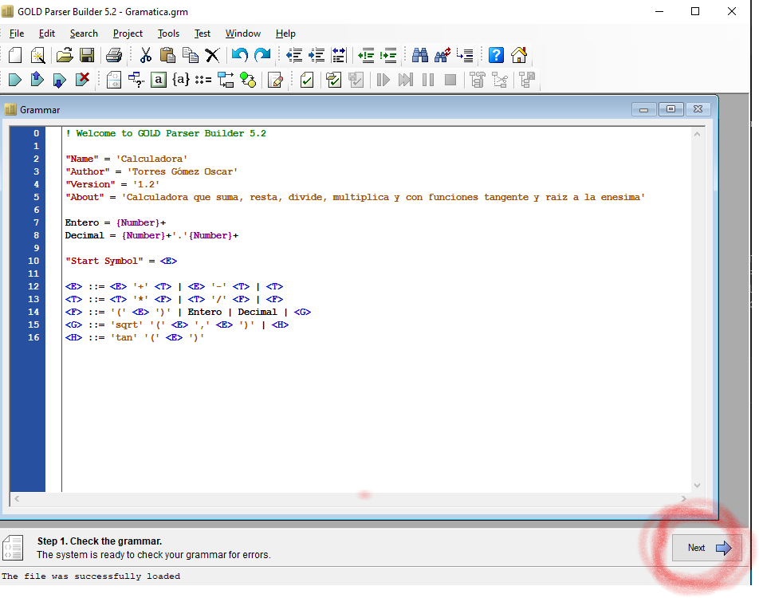
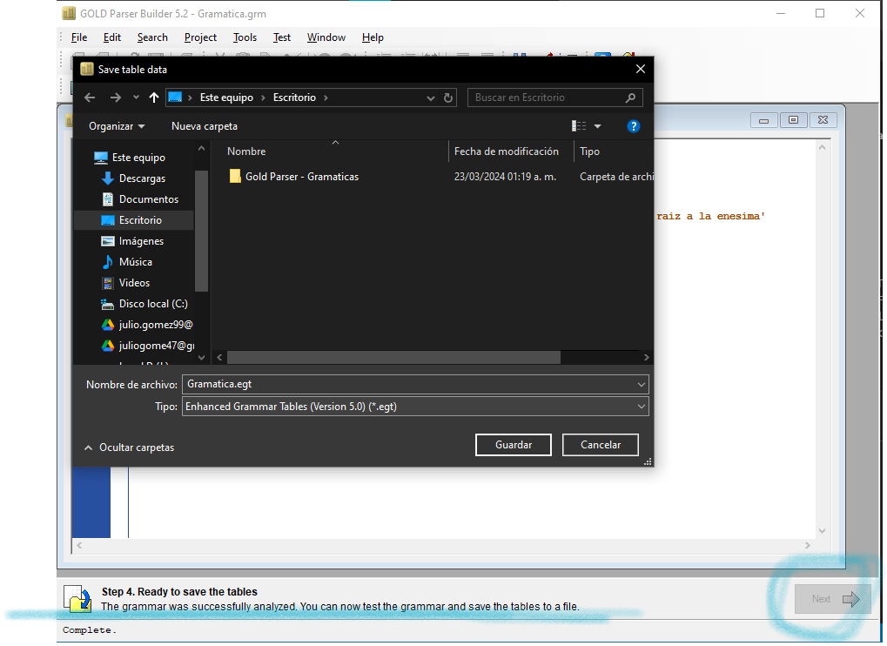
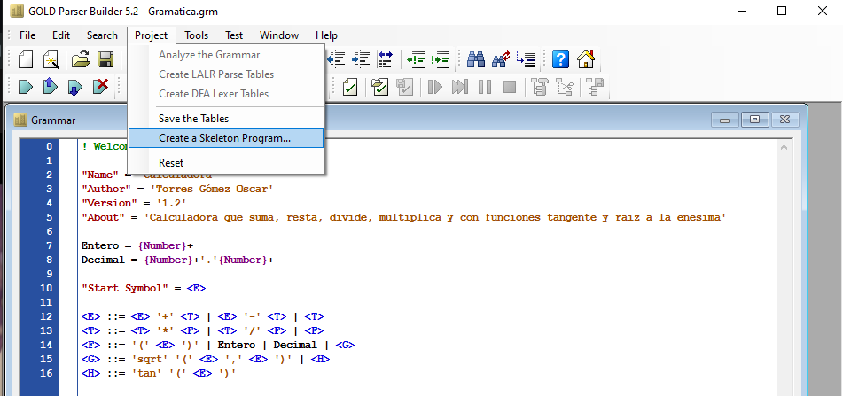
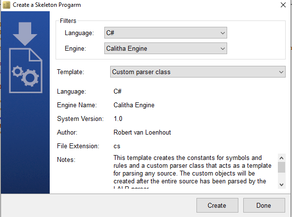
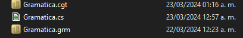
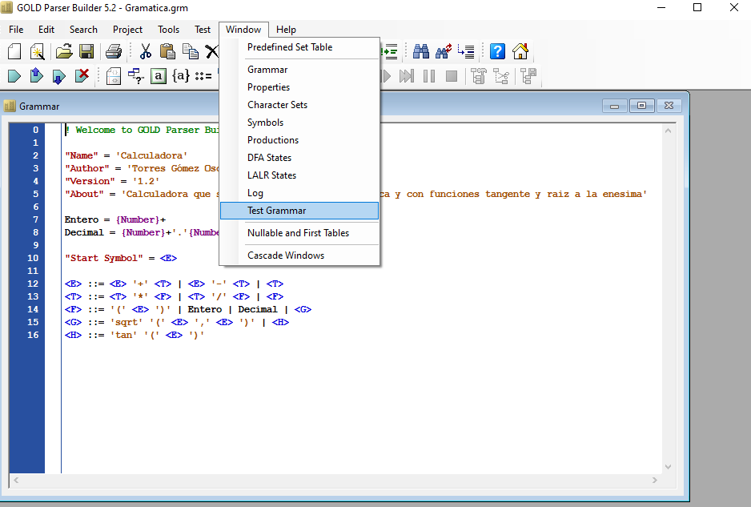
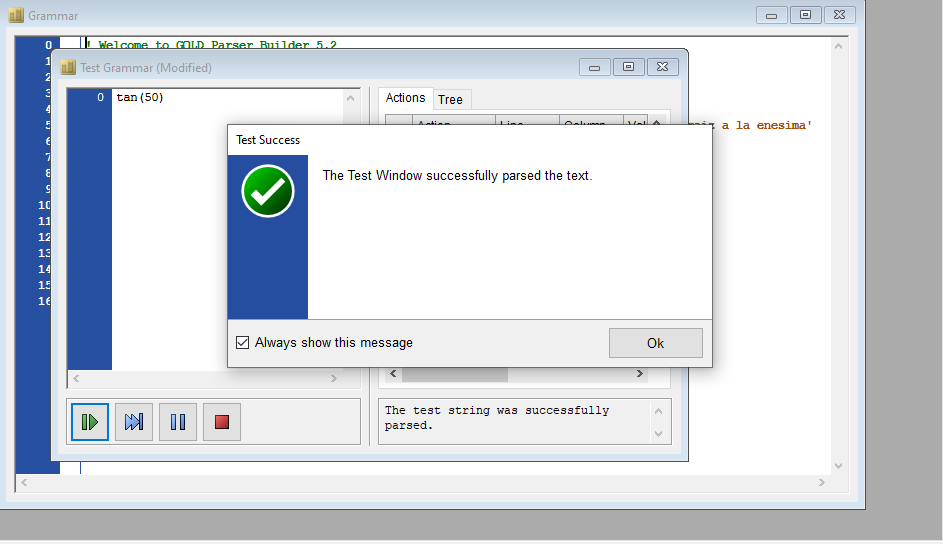

# GOLD PARSER

## GRAMATICAS EN GOLD PARSER

En gold parser tenemos la siguiente gramatica.
que son las operacioes basicas de una calculadora, suma resta etc.

```text

<E> ::= <E> '+' <T> | <E> '-' <T> | <T>
<T> ::= <T> '*' <F> | <T> '/' <F> | <F>
<F> ::= '(' <E> ')' | Entero | Decimal

```

Teniendo eso toca agregar las funciones asignados a nuestro equipo que son tangente y raiz a la enesimam (SQRT)

Se crea dos simbolos no terminales que son **G** es el que da acceso a la raiz y **H** se utiliza cuando en la calculadora es ingresado una tangente

```text
<G> ::= 'sqrt' '(' <E> ',' <E> ')' | <H>
<H> ::= 'tan' '(' <E> ')' | 'tan'<E> | Entero | Decimal

```

   >[!NOTE]
   >
   >No se puede asignar el simbolo de √ en goldparser porque C# lo toma como error, dejandolo como 'sqrt'


### GRAMATICA GENERAL CON FUNCIONES Y EXPRESIONES REGULARES

Una vez teniendo la gramatica de las funciones las gramatica general queda de la siguiente forma.

```text
! Welcome to GOLD Parser Builder 5.2

"Name" = 'Calculadora'
"Author" = 'Torres Gómez Oscar'
"Version" = '1.2'
"About" = 'Calculadora que suma, resta, divide, multiplica y con funciones tangente y raiz a la enesima'
        
Entero = {Number}+
Decimal = {Number}+'.'{Number}+
        
"Start Symbol" = <E>
 
<E> ::= <E> '+' <T> | <E> '-' <T> | <T>
<T> ::= <T> '*' <F> | <T> '/' <F> | <F>
<F> ::= '(' <E> ')' | Entero | Decimal | <G> 
<G> ::= 'sqrt' '(' <E> ',' <E> ')' | <H>
<H> ::= 'tan' '(' <E> ')'

```

## ¿COMO UTILIZAR GOLD PARSER?

Una vez que tengamos las gramaticas con el sintaxis de gold parser procedemos a pegarlo en gold parser, le damos en el boton de NEXT ->


Si la gramatica esta correcta nos dejara avanzar hasta el paso 4, donde ya nos saldra la opcion de guardar la tabla sintactica que se utilizara en C#.

En la siguiente imagen muestre que la gramatica es correcta y nos dejo avanzar hasta el nivel 4, guardamos el archivo con una extension .CGT



### GENERAR ESQUELETO PARA CS

Generamos el esqueleto para c#. Esto nos generara una clase para implementarlo en la interfaz grafica de la calculadora.



Por ultimo en el icono de guardamos la gramatica pulsando el icono de Guardar para guardar la gramatica. en total nos debe generar 3 archivos que se presentan en la siguiente imagen.



### TESTEO DE GRAMATICAS EN GOLD PARSER

Para hacer pruebas si funciona nuestra gramatica nos vamos a las siguientes pestañas. **windows - Test Grammar**



Ingresamos una ecuacion que consideremos correcta, por ejemplo tan(50), si es correcta nos mostrara una ventana de que se redujo con exito. PROBAR CON DISTINTAS ECUACIONES


## CREACION DE LA CALCULADORA EN C

